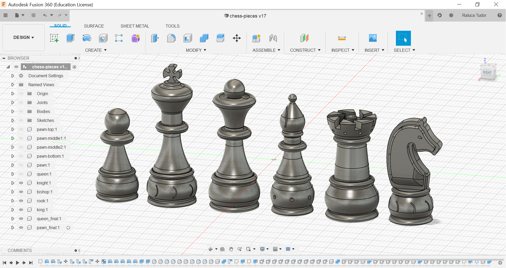

# Homework no. 3

Design a chess pieces set:\
a. 1 pawn,\
b. 1 knight:horse:,\
c. 1 bishop,\
d. 1 rook,\
e. 1 queen,\
f. 1 king.

The tricky part about this homework was making each piece as a "one body". At first, for the pawn, I  measured the dimension between the pieces (see the figure below) and moved&copied the pieces so that they are combined. Foe the pawn, I used the "Rigid Group" tool, too. For the other pieces, however, I chose to use the "Press Pull" tool to merge the pieces together and the the "Combine" tool to make them as 1 body in a component. I also derived each chess piece individually so that I have the F3D files for them - containing only one body, as requested!

